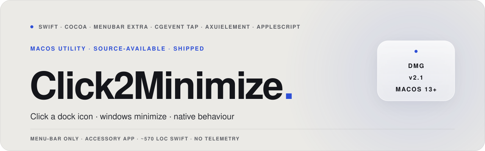

<p align="center">
  <picture>
    <source media="(prefers-color-scheme: dark)" srcset="assets/hero-banner-dark.svg" />
    
  </picture>
</p>

<p align="center">
  <a href="https://github.com/hatimhtm/Click2Minimize/releases/latest"></a>
  
  
  
  <a href="LICENSE"></a>
</p>

<p align="center">
  <em><strong>Click an app's dock icon to minimize its windows.</strong> macOS doesn't ship with this behaviour by default: Click2Minimize is a ~570-LOC Swift menu-bar utility that adds it. Accessory app, no window, no telemetry. Lives in the menu bar, runs an event tap, talks to the dock via Accessibility + AppleScript. Free to use personally, not for commercial reuse (see <a href="LICENSE">LICENSE</a>).</em>
</p>

## What it does

When you click the dock icon of an already-focused app, macOS does nothing: the click just re-activates an app that's already active. Click2Minimize swaps that no-op for the obvious behaviour: minimize the app's windows. Click again to bring them back. Like the Windows taskbar, but on macOS.

- Click a **focused** app's dock icon → windows minimize.
- Click an **unfocused** app's icon → default macOS behaviour (focus, raise).
- Click **Launchpad / Trash / Downloads** → default behaviour (these have no windows to minimize).
- App is **fullscreen** → pass-through (no minimize, you didn't mean it).

## How it works

```
                                                 ┌─────────────────────┐
                                                 │ NSWorkspace notifs  │
                                                 │  (launch · activate │
                                                 │   · space change)   │
                                                 └──────────┬──────────┘
                                                            │ debounced 300ms
                                                            ▼
┌─────────────────┐    ┌─────────────────┐    ┌─────────────────────────┐
│ CGEvent tap     │───▶│ hit-test mouse  │───▶│ AppleScript query Dock  │
│ (left mousedown)│    │ vs dock rects   │    │ → rects + app names     │
└─────────────────┘    └─────────────────┘    └─────────────────────────┘
                                │
                                ▼
              ┌─────────────────────────────────────────┐
              │ AXUIElement → set kAXMinimized = true   │
              │ on every visible window of the app      │
              └─────────────────────────────────────────┘
```

- **Event tap** runs at `cghidEventTap` / `tailAppendEventTap`, captures left mouse-down only.
- **Dock rects** are cached and refreshed on a trailing-edge 300ms debounce: bursts of `didLaunch / didActivate / activeSpaceDidChange` collapse into a single AppleScript call.
- **Window minimization** goes through `AXUIElementSetAttributeValue(kAXMinimizedAttribute)`: the proper accessibility API, not key-event simulation.
- **Fullscreen detection** reads `AXFullScreen` on the frontmost app's windows (rewritten in 1.5: the old check was inspecting Click2Minimize's own windows).

## Highlights

| | |
|---|---|
| **No window** | `LSUIElement`-style accessory app; lives only in the menu bar |
| **No telemetry** | Zero network calls except the GitHub releases check on launch |
| **No background daemon** | Just one process, registers a `CGEvent` tap via Accessibility |
| **Modern Swift logging** | `os.Logger` with subsystem + privacy modifiers; no `print()` spam in Release |
| **Opt-in launch-at-login** | SwiftUI toggle wires `SMAppService.mainApp` register/unregister; was unconditional before 1.5 |
| **Fallback dock scan** | If `AXUIElement` can't read the dock list, an AppleScript fallback recovers app names from `System Events` |
| **Universal binary** | `xcodebuild -configuration Release` produces arm64 + x86_64; ad-hoc signed DMG |
| **Source-available** | PolyForm Noncommercial 1.0.0: read it, learn from it, run it personally, don't ship it |

## 2.1: what changed from 2.0

- **Fixed**: `isActiveAppFullscreen()` was inspecting Click2Minimize's own `NSWindow`s: always returned false. Rewritten to read `AXFullScreen` on the frontmost app via Accessibility.
- **Fixed**: dock-item ignore-list was `"Launchpad||Trash||Downloads".contains(name)`: substring match, would catch "TrashCan" or any app with "Trash" in the name. Replaced with proper `Set` membership.
- **Fixed**: dock-update debounce was firing every event and only suppressing later ones inside the 0.5s window: it never actually coalesced bursts. Rewritten with `DispatchWorkItem` trailing-edge debounce at 300ms.
- **Improved**: all `print()` calls migrated to `os.Logger` with privacy modifiers. Release builds no longer write to stdout.
- **Improved**: launch-at-login is now an opt-in toggle in Settings instead of unconditional. Existing installs that were auto-registered stay registered until toggled off.
- **Improved**: settings sheet redesigned (launch-at-login row, cleaner spacing, footnote anchored).
- **Improved**: deprecated `NSWorkspace.launchApplication(_:)` swapped for `openApplication(at:configuration:completionHandler:)`.
- **Bumped**: marketing version → 2.1 to align the in-app version with the GitHub release tag (was 1.4 in-plist while the latest release was already tagged v2.0).

## Install

1. Grab the latest `.dmg` from [Releases](../../releases/latest).
2. Open it, drag `Click2Minimize.app` into `/Applications`.
3. Launch it. You'll be prompted for **Accessibility** permission: open System Settings → Privacy & Security → Accessibility, toggle Click2Minimize on.
4. If you use Catalyst / Electron apps and want the fallback to work cleanly, also grant **Automation** (asked on first need).

The DMG is ad-hoc signed, so the first launch will need a right-click → Open to get past Gatekeeper.

## Build from source

```bash
git clone https://github.com/hatimhtm/Click2Minimize.git
cd Click2Minimize

# Release build into ./build
xcodebuild -scheme Click2Minimize -configuration Release -derivedDataPath build

# Or build the full DMG in ./dist
./build_dmg.sh
```

Requires Xcode 15+. Targets macOS 13.0+.

## License

[PolyForm Noncommercial 1.0.0](LICENSE). In plain English:

- **Allowed**: reading, learning, personal use, hobby use, non-profit / educational / research use, forking to improve, distributing your fork under the same license.
- **Not allowed**: shipping it inside a paid product, selling support for it, embedding it in commercial software, any commercial use.

If you want a commercial license, [open an issue](../../issues) or [book a call](https://cal.com/hatimelhassak/engineering-discovery).

---

<p align="center">
  <a href="https://hatimelhassak.is-a.dev">Portfolio</a> ·
  <a href="https://cal.com/hatimelhassak/engineering-discovery">Book a call</a> ·
  <a href="https://www.linkedin.com/in/hatim-elhassak/">LinkedIn</a> ·
  <a href="mailto:hatimelhassak.official@gmail.com">Email</a> ·
  <a href="https://buymeacoffee.com/hatimelhassak">Buy me a coffee</a>
</p>
